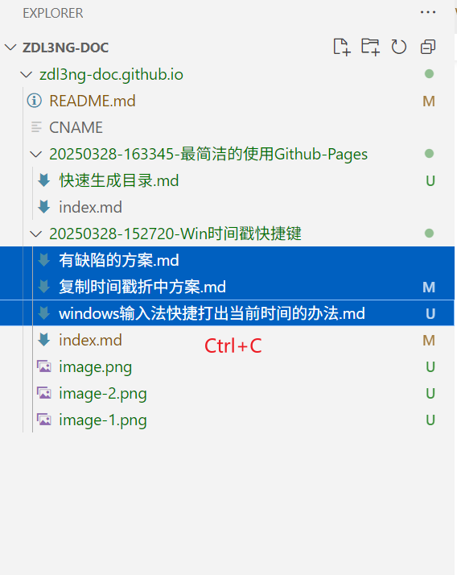
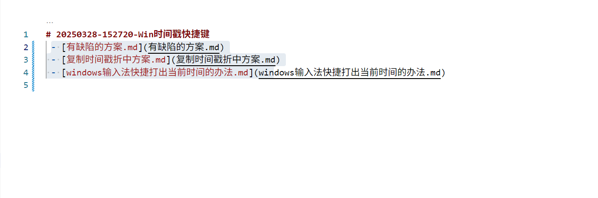
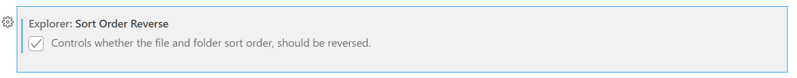

# 最简洁的使用Github-Pages
利用vscode对markdown的强大支持，方便的管理md文件，并利用Github-Pages的jekyll对md的解析，配上域名，就可以有自己的博客站点了。
> 以最简洁的方式使用Github Pages，不用安装 hexo, jekyll, hugo
> 结合 vscode客户端 或者 githhub.dev网页端，再加上合理的管理目录，轻松写markdown, 生成静态博客网站。

## 文件管理问题
1. 文件夹：时间戳-名称（注意不要有空格）
2. 文件夹下：必须有一个index.md,作为子文件夹内容目录
3. index.md：只引用同级下的文件夹/文件
4. 文件夹可以嵌套，但必须遵循以上规则：整理调整目录，只用修改index.md，不用改文章。

## 目录快速生成问题

### 1. 选中目录下的要列入目录的文件：

### 2. 在index.md文件中粘贴
注意：最前面应桥一个空格

### 3. 替换目录
- 打开替换：按快捷键 Ctrl + H（Windows/Linux）或 Command + Option + F（Mac）。
- 查找：`\[text\]\((.*?)\)` 选中正则
- 替换：`- [$1]($1)\n` 全局替换

> 同理：文件夹目录也可以这么操作

## 文件夹排序问题
默认 文件夹是正序，从小到大，只需要将`Explorer`的`Sort Order Reverse`设置为`true`，就可以倒排序，实现最近的文章在前面。

