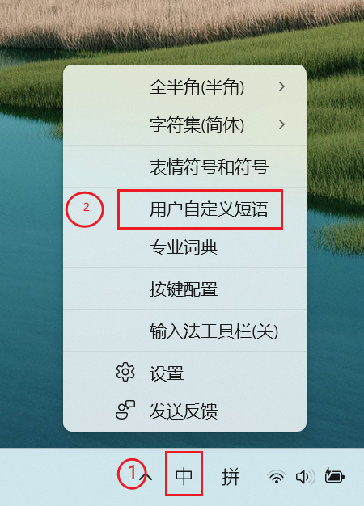
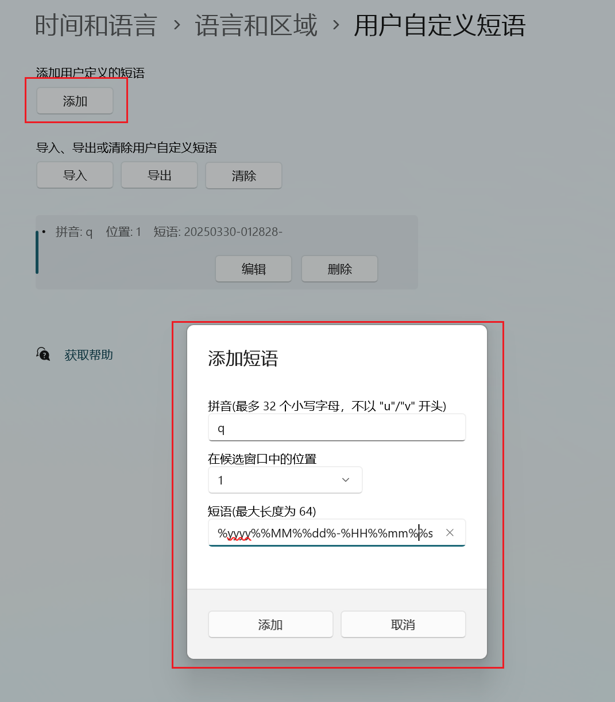
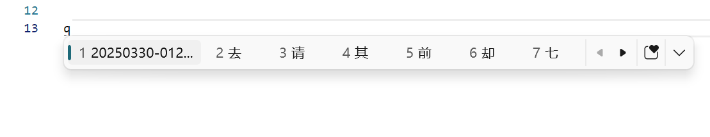

# windows输入法快捷打出当前时间的办法

> [参考文章地址](https://blog.csdn.net/shaun2001/article/details/139060524)
> 
> 使用的是 输入法【用户自定义短语】功能，关键是知道：输入法【用户自定义短语】的格式支持时间格式。
> 
> 输入法的用户自定义短语通常还支持以下内容:
> #### 日期相关
> 
> - `%yyyy%`：四位年份
> - `%MM%`：两位月份
> - `%dd%`：两位日期
> - `%w%`：星期几（数字形式）
> - `%ww%`：星期几（完整名称）
> 
> #### 时间相关
> 
> - `%HH%`：24 小时制小时
> - `%hh%`：12 小时制小时
> - `%mm%`：分钟
> - `%ss%`：秒
> - `%tt%`：上午/下午标识（如 AM/PM）
> 
>  #### 文本占位符
> 
> - 一些输入法支持自定义占位符，用于插入固定文本或动态内容。
> 
> #### 快捷短语
> 
> - 自定义短语可以是常用的句子、签名、地址、邮箱等。例如：
>   - `addr` → 北京市海淀区某某路
>   - `email` → example@example.com
> 
> #### 特殊符号
> 
> - 一些输入法支持插入特殊符号或表情符号，例如：
>   - `→`、`←`、`★`、`❤` 等。
> 
> #### 动态内容（部分输入法支持）
> 
> - 当前时间戳
> - 当前日期
> - 用户名或设备名
>

## 输入法右键设置用户自定义短语：位置

## 输入法右键设置用户自定义短语：设置

%yyyy%%MM%%dd%-%HH%%mm%%ss%- ：格式可以根据自己需要调整

## 效果图：

