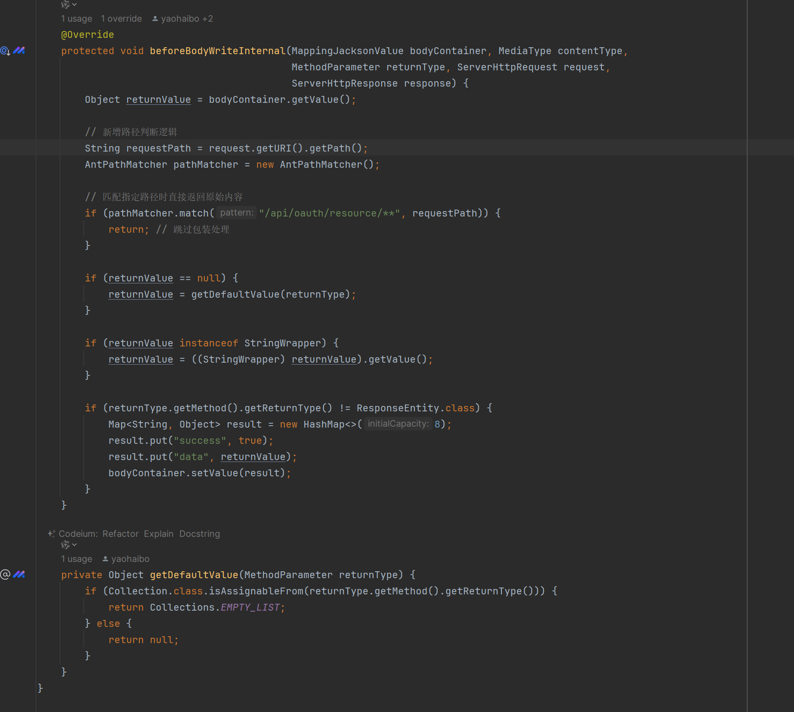

# Chrome插件开发
学习内容




```java
package io.terminus.parana.advice;

import org.springframework.core.MethodParameter;
import org.springframework.core.Ordered;
import org.springframework.core.annotation.Order;
import org.springframework.http.MediaType;
import org.springframework.http.ResponseEntity;
import org.springframework.http.converter.json.MappingJacksonValue;
import org.springframework.http.server.ServerHttpRequest;
import org.springframework.http.server.ServerHttpResponse;
import org.springframework.util.AntPathMatcher;
import org.springframework.web.bind.annotation.ControllerAdvice;
import org.springframework.web.servlet.mvc.method.annotation.AbstractMappingJacksonResponseBodyAdvice;

import java.util.Collection;
import java.util.Collections;
import java.util.HashMap;
import java.util.Map;

/**
 * 将正常的返回值套上一些附加信息
 *
 * @author : dadu
 * @since : 2018-01-18
 */
@Order(Ordered.HIGHEST_PRECEDENCE + 1)
@ControllerAdvice
public abstract class AbstractRestResponseHandler extends AbstractMappingJacksonResponseBodyAdvice {

    @Override
    protected void beforeBodyWriteInternal(MappingJacksonValue bodyContainer, MediaType contentType,
                                           MethodParameter returnType, ServerHttpRequest request,
                                           ServerHttpResponse response) {
        Object returnValue = bodyContainer.getValue();

        // 新增路径判断逻辑
        String requestPath = request.getURI().getPath();
        AntPathMatcher pathMatcher = new AntPathMatcher();

        // 匹配指定路径时直接返回原始内容
        if (pathMatcher.match("/api/oauth/resource/**", requestPath)) {
            return; // 跳过包装处理
        }

        if (returnValue == null) {
            returnValue = getDefaultValue(returnType);
        }

        if (returnValue instanceof StringWrapper) {
            returnValue = ((StringWrapper) returnValue).getValue();
        }

        if (returnType.getMethod().getReturnType() != ResponseEntity.class) {
            Map<String, Object> result = new HashMap<>(8);
            result.put("success", true);
            result.put("data", returnValue);
            bodyContainer.setValue(result);
        }
    }

    private Object getDefaultValue(MethodParameter returnType) {
        if (Collection.class.isAssignableFrom(returnType.getMethod().getReturnType())) {
            return Collections.EMPTY_LIST;
        } else {
            return null;
        }
    }
}
```